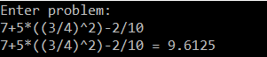

# MathTree

Made in 2019

This project takes from the console a math expression that includes parentheses, addition (+), subtraction (-), multiplication (*), division (/) and/or exponentiation (^) and solves it.

pi and e are also recognized.

